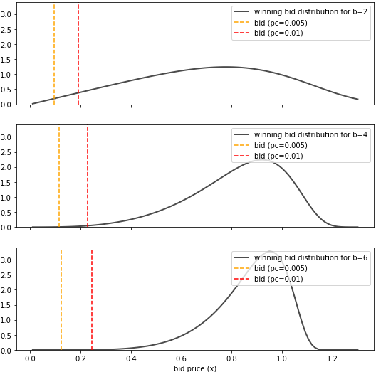

# Ad auction bidding strategy


## Theory 

Consider the case of participating in `N ≫ 1` online ad auctions with a limited bidding 
budget. The task is to create such a bidding strategy that you can win some of them, and 
that the placed ads generate at least $n_{click}$ clicks. This should be done by spending as 
little money as possible.

The ad auctions can be put into several groups based on:
- the probability $p_{ctr}$ that a user will click on the displayed ad if we win the auction
- the probability $p_{aucwin}$ to win an auction if we place a bid

The optimal bids for the different auction groups are obtained by the constrained optimization
problem where we have to minimize the expected spent budget $f(x)$ given that the difference 
between expected number of generated ad-clicks and $n_{click}$, $g(x)$, is zero:


$$  
\begin{align*}  
f(x) & = \sum_{m\in\mathcal{M}} n_m \cdot x_m \cdot p_{aucwin,m}(x_m), \\  
g(x) & = \sum_{m\in\mathcal{M}} n_m \cdot p_{ctr,m} \cdot p_{aucwin,m}(x_m) - n_{click}  
\end{align*}    
$$


where $\mathcal{M}$ refers to the different auction groups and $n_m$ to the number of 
auctions that belong to this group.


We assume that the number of auction groups $\mathcal{M}$, group sizes 
$\lbrace n_m\vert m\in\mathcal{M}\rbrace$ and ctr probabilities $\lbrace p_{ctr,m} \vert m\in\mathcal{M} \rbrace$ 
can be easily inferred from past events. To obtain the probability to win an auction we 
have implemented two options:

- Construct it directly from the winning-bids $\lbrace s_i\vert i\in\mathcal{I} \rbrace$ from past auctions of this type ($\Theta(x) = 0$ if $x>0$ and $0$ otherwise):


$$
\begin{align*}
p_{aucwin} (x) & = \sum_{i\in \mathcal{I}} \Theta(b_i < x) \Big/  \sum_{i\in \mathcal{I}}  1,
\end{align*}
$$


- Use the cumulative distribution function of an analytical function for the distribution of winning bids $p_{winbid}$ obtained, for example, through some variational inference approach:


$$
\begin{align*}
p_{aucwin}(x) & = \int^{x}_{0} p_w (b) \cdot db 
\end{align*}
$$


A detailed description of the problem and the possible solutions is provided in [this document](pdf/bidding_strategy.pdf).


## Implementation


The optimization problem is solved numerically 10 times and the best solution
is used as a final result.


- An example how to find the bid strategy for two auction groups with if we use analytical functions for the winning bid distributions is provided below:
  ```shell
  PYTHONPATH=src python src/main.py optimize \
      --n-click=100 \
      --p-ctr='0.02, 0.02' \
      --n='20_000, 10_000' \
      --winbid-dist='[{"name": "exponpow", "params": {"b": 2}}, {"name": "exponpow", "params": {"b": 4}}]' \
      --winbid-dist-analytical
  ```
  We have used the [exponential power distribution](https://docs.scipy.org/doc/scipy/reference/generated/scipy.stats.exponpow.html) to describe the winning bid distributions of both auction groups.


- To solve the same problem by using samples of the winning-bids from past auctions, we first have to generate these samples:
  ```shell
  PYTHONPATH=src python src/main.py generate-data \
      --winbid-dist='[{"name": "exponpow", "params": {"b": 2}},{"name": "exponpow", "params": {"b": 4}}]' \
      --save-path='data.json'
  ```
  The use these samples in the algorithm set `winbid-dist` to the path where the samples are stored ('data.json') and remove the `--winbid-dist-analytical` flag:
  ```shell
  PYTHONPATH=src python src/main.py optimize \
      --n-click=100 \
      --p-ctr='0.02, 0.02' \
      --n='20_000, 10_000' \
      --winbid-dist='data.json'
  ``` 

More examples are provided in this [Jupyter notebook](Example.ipynb).


## Original solution


The code used for the solution of the problem described in [this blog post](https://medium.com/ki-labs-engineering/an-ad-auction-bidding-strategy-cd8f95d77d50) can be found in this [release](TODO)


